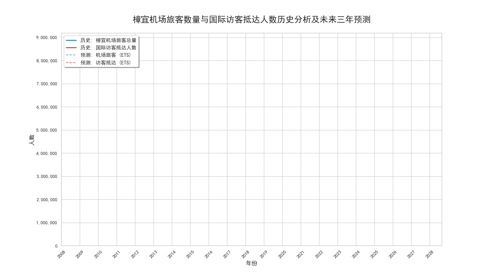
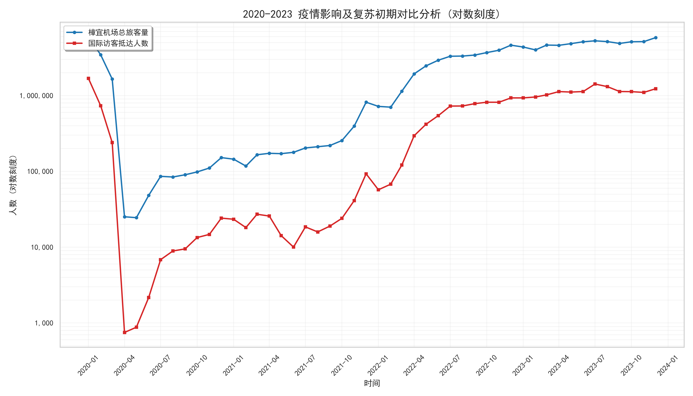
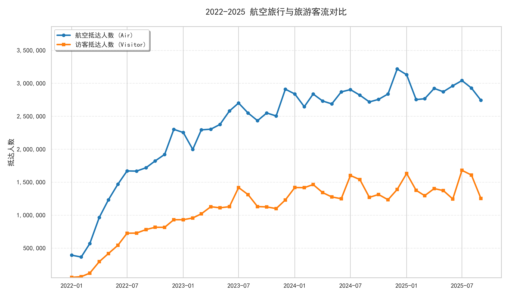
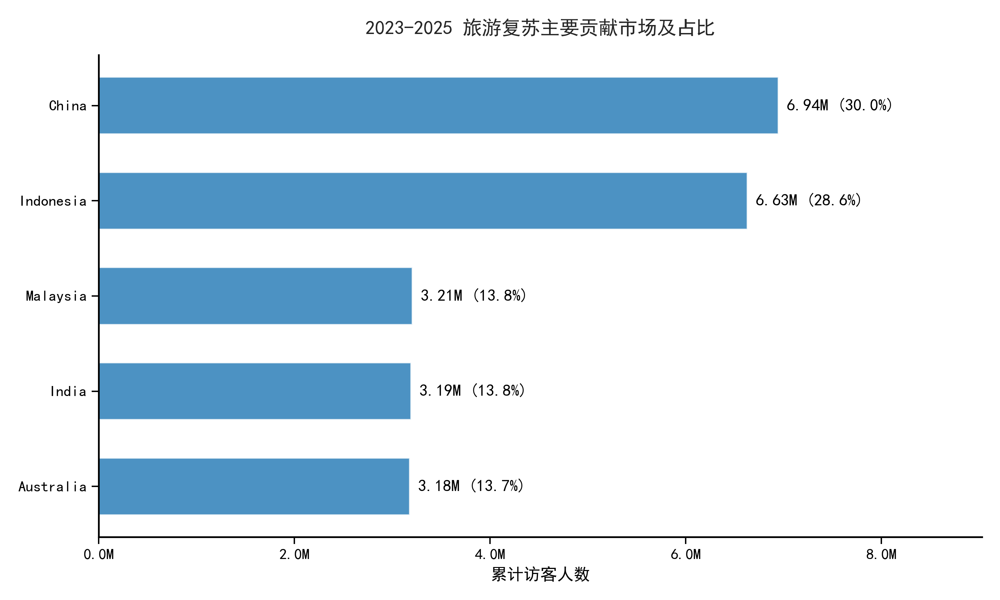
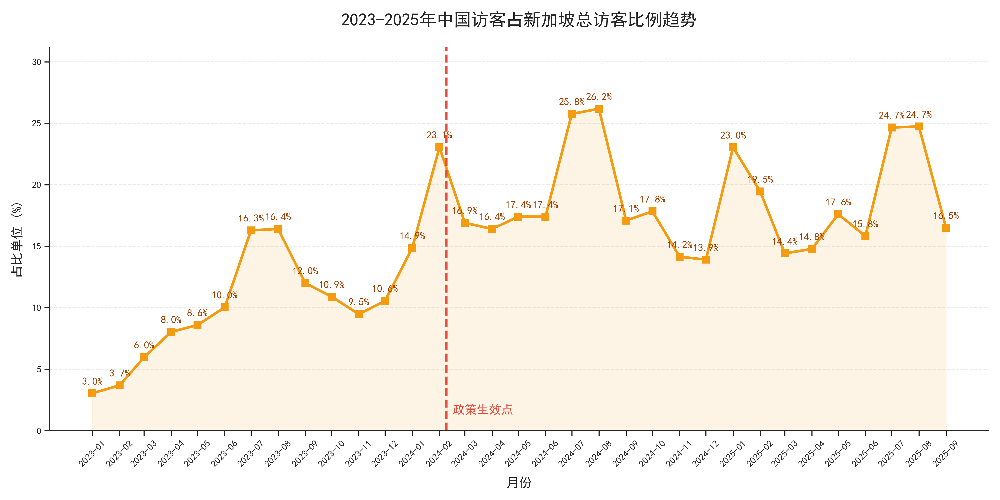
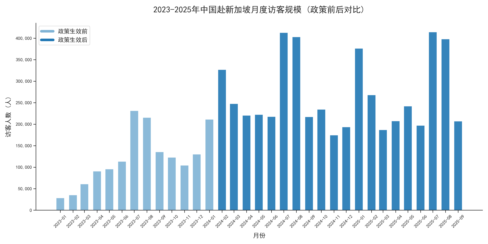

# 樟宜机场旅客运输与新加坡旅游市场恢复分析

**Changi Airport Passenger Traffic & Singapore Tourism Recovery Analysis (2008–2025)**

基于新加坡统计局（SingStat）的月度数据，分析新冠疫情前后樟宜机场旅客量与国际访客抵达人数的变化，预测未来三年走势，识别复苏的主要贡献市场，并重点评估中国与新加坡**互免 30 天签证政策**（2024 年 2 月 9 日生效）前后的中国访客变化。

  



---

## 1. 项目背景与问题

疫情让全球航空与旅游业遭受重创。新加坡的复苏进展如何？谁是复苏的主要推动力？免签政策对中国访客有多大帮助？本项目围绕四个问题展开：

1. 樟宜机场旅客量与国际访客人数的长期趋势、季节性如何？未来三年大致走向如何？
2. 疫情前、中、后，航空旅行与旅游客流的关系如何变化？
3. 国际访客的区域构成如何？哪些市场对复苏贡献最大？
4. 中国访客的趋势与季节性如何？免签政策生效前后有何变化？

## 2. 数据

| 项目 | 说明 |
|---|---|
| 数据来源 | 新加坡统计局 SingStat（Table Builder） |
| 航空数据 | `Airtransport outputFile.xlsx`：`T1` 为月度数据，`T2` 为年度数据（含旅客总量、抵达旅客量等） |
| 访客数据 | `international resident data.csv`：按居住地划分的月度国际访客抵达人数（含总量及各区域/国家，如中国） |
| 时间范围 | 月度数据 2008 年至 2025 年 9 月；年度对比使用 2008 年起的数据 |

> 本仓库**不包含原始数据**，运行方式见第 9 节。

## 3. 分析流程

```
数据读取与清洗（宽表转置、时间索引重构）
   → 时间序列趋势与 ETS 预测 → 疫情前后对比 → 区域构成分析 → 复苏贡献市场
   → 中国访客专项分析（趋势、占比、季节性、免签政策前后对比）
```

| 步骤 | 做法 |
|---|---|
| 数据清洗 | SingStat 导出的是“列为月份”的宽表，转置后用 `%Y %b` 解析为时间索引，文本数字转数值；统一封装为清洗函数 |
| 趋势与预测 | 使用 **ETS（加法误差、加法趋势、加法季节，周期 12）** 预测未来 36 个月，并给出预测区间；仅用 2022 年起的数据训练，排除疫情期极端值 |
| 区域构成 | 年度访客与机场总旅客量对齐；平均占比低于 1.5% 的区域（West Asia、Americas、Africa、Others）合并为“小份额区域”，避免图例拥挤 |
| 疫情前后对比 | 2020–2023 年航空抵达人数与访客抵达人数对比，使用对数坐标展现疫情冲击与复苏初期 |
| 中国专项 | 2010–2025 年中国访客趋势、占总访客比例、月度规模，并标出政策生效点（2024-02-09），区分政策前后 |
| 可复现性 | 数据路径、时间范围、输出目录和随机种子集中放在 notebook 开头的参数配置单元格 |

**工具**：Python（pandas、numpy、statsmodels、matplotlib、seaborn）

## 4. 主要发现

### 4.1 三个阶段与季节性

- **2008–2019 稳定增长**：月度旅客量最高值由约 300 万升至约 650 万；月度国际访客最高值由不足 100 万升至约 180 万。
- **2020–2022 断崖下跌**：2020 年 4 月国际访客抵达人数跌到不足 1000 人。
- **2022 年起快速复苏**：截至 2024 年底，月度旅客量最高已超 600 万，基本回到 2019 年水平。
- **季节性**：旅客总量通常在年底（假期、节庆）达到高峰；国际访客的高峰多出现在年中。



### 4.2 未来三年预测

ETS 预测显示，到 2027 年月度旅客量最高值可能突破 700 万，月度国际访客最高值可能超过 200 万。这一结果受训练数据和趋势假设影响较大，见第 7 节局限。

### 4.3 区域构成与复苏贡献

- 2024 年国际访客约 1500 万，而机场旅客总量超过 6500 万，说明有大量过境/中转旅客，存在把机场旅客转化为入境访客的空间。
- **东南亚**始终是第一大客源，疫情后率先恢复；**大中华区**是第二大客源，2024 年增速最快；**欧洲**为第三。
- 疫情后，航空抵达人数增速在复苏初期略快于访客抵达人数，说明航空枢纽功能先于旅游吸引力恢复；2022 年 1 月至 2025 年 9 月，航空抵达人数由不足 50 万增至约 275 万，访客抵达人数增至约 125 万。
- 在复苏贡献前五大市场中，**中国（30%）和印度尼西亚（28.6%）**合计占 58.6%，其后是马来西亚（13.8%）、印度（13.8%）和澳大利亚（13.7%）。





### 4.4 中国访客与免签政策

- 2024 年 2 月政策生效后，中国访客人数和占总访客的比例明显上升；2024 年 2 月占比为 23.1%，2024 年 8 月最高达 26.2%，暑期（7–8 月）占比约 25%。
- 月度访客多次达到约 40 万人，为 2010 年以来的高位。
- 中国访客有两个季节性高峰：**1–2 月（春节）**和 **7–8 月（暑假）**。





## 5. 业务建议

- **针对中国市场**：在春节和暑假高峰开发深度游和研学亲子产品，完善移动支付、中文导视等服务；机场与航空公司按高峰动态调配人员和航班。
- **扩大客源**：在东南亚、印度尼西亚等主要市场加强推广，并研究与更多国家的免签合作。
- **转化机场旅客**：将过境旅客转化为入境访客，提高人均消费。
- **容量规划**：预测显示客流持续增长，需配合机场扩建（如 T5）推进。

## 6. 图表说明

| 文件 | 内容 |
|---|---|
| `figure_1.gif` | 旅客量与国际访客人数历史及三年预测（动画） |
| `figure_2.png` | 疫情冲击与复苏初期对比（对数坐标） |
| `figure_3.gif` | 机场旅客构成演变（动画） |
| `figure_4.png` | 航空抵达与访客抵达对比 |
| `figure_5.png` | 复苏主要贡献市场及占比 |
| `figure_6.png` | 2010–2025 中国赴新访客趋势 |
| `figure_7.png` | 中国访客占总访客比例 |
| `figure_8.png` | 中国访客月度规模（政策前后） |

## 7. 局限与改进方向

- **政策效果不等于因果**：目前是政策前后的描述性比较，访客增长也可能来自整体复苏、春节暑期等季节因素和中国出境游本身的恢复。改进：使用中断时间序列或双重差分（与其他市场对比）等方法，更严格地估计政策效应。
- **预测的可靠性**：ETS 只用 2022 年起约 45 个月数据训练，其中包含复苏爬坡期，加法趋势可能高估长期增速；且没有留出验证集评估预测误差。改进：滚动回测，并与季节性 ARIMA 等模型对比。
- **指标口径**：机场旅客总量包含过境旅客，与入境访客不是同一概念，分析时需区分。
- **缺少收入类数据**：没有人均消费、旅游收入等指标，无法评估“访客增长”对应的经济收益。

## 8. 仓库结构

```
├── README.md
├── code.ipynb             # 完整分析代码
├── requirements.txt
└── images/                # 输出图表
```

## 9. 如何运行

1. 克隆仓库并安装依赖：
   ```bash
   git clone https://github.com/wang-rann/changi-airport-tourism-recovery.git
   cd changi-airport-tourism-recovery
   pip install -r requirements.txt
   ```
2. 准备数据：因授权原因，原始数据未上传。请从数据来源下载并保存为：
   - `Airtransport outputFile.xlsx`（含工作表 `T1`、`T2`）
   - `international resident data.csv`

   两个文件均为 SingStat 导出格式，前 9 行为说明信息（代码中 `skiprows=9`），放在与 notebook 同一目录。
3. 按需修改 notebook 开头的参数配置（文件路径、日期范围、输出目录），然后按顺序运行。
4. 图表中包含中文，需要系统安装 SimHei 或 Microsoft YaHei 字体，否则中文会显示为方块。动图保存使用 Pillow。

> Notebook 中已保留各步骤的运行结果，不运行也可直接查看。

## 10. 说明

本项目为课程项目，仅用于学习与展示分析方法。

**联系方式**：wangran002@suss.edu.sg｜ 【LinkedIn / 个人主页】
